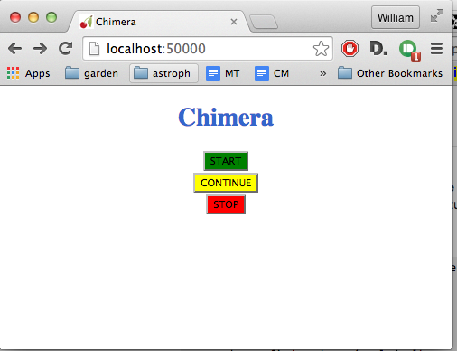

chimera-webadmin plugin
=======================

A simple plugin to START/STOP/RESUME robotic telescope operations from the web. It is useful when an operator is in
charge of starting/stopping the operations in the observatory.

**Note:** This plugin is intended to be used on internal networks (i.e. only observatory-wide or networks accessed over
a VPN and behind a firewall). There is no security implemented on this plugin.

Usage
-----

Install chimera-webadmin and add a controller of type WebAdmin on the configuration file. Then open in the browser the
webpage http://localhost:50000/

Installation
------------

Installation instructions. Dependencies, etc...

::

    pip install -U git+https://github.com/astroufsc/chimera-webadmin.git

Configuration Example
---------------------

This example changes the listen port from the default `50000` to the port `8088` and forces the WebAdmin socket to listen
on all interfaces.

::

  - type: WebAdmin
    name: webadmin
    socket_host: 0.0.0.0
    socket_port: 8088

Contact
-------

For more information, contact us on chimera's discussion list:
https://groups.google.com/forum/#!forum/chimera-discuss

Bug reports and patches are welcome and can be sent over our GitHub page:
https://github.com/astroufsc/chimera-webadmin/
